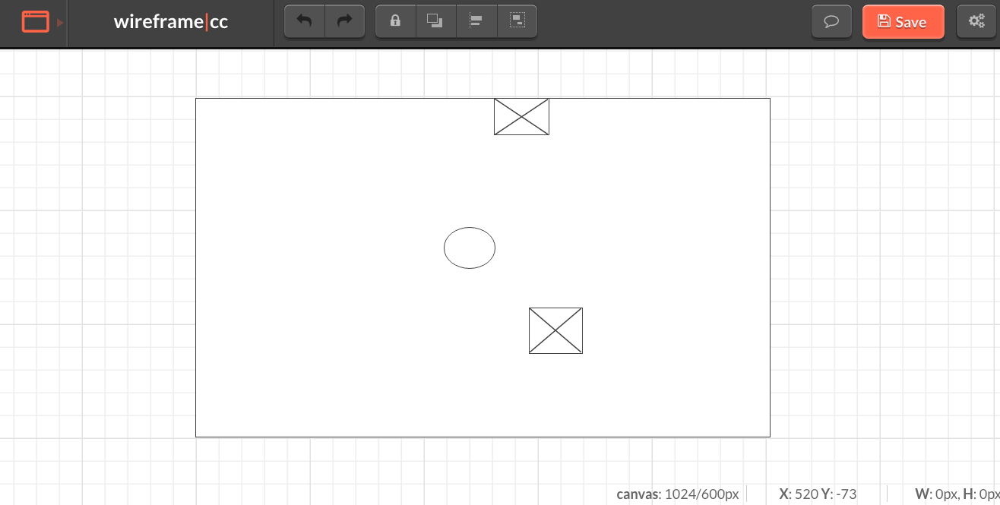

Dodge Wrench

Goal 
To create a functional game uploaded onto Github Pages.

Installation
To access the game, go to the url:
https://github.com/teachmehowtocode

Wireframes
I created the wireframe https://wireframe.cc/tHxCKr in the wireframe.cc website.

Approach Taken
I decided to tackle the most challenging parts first to determine whether I was capable of 
producing the game I thought of. The most challenging part was putting the javascript 
function that moved the divs inside a larger div and having them recognize one another.
It took me a few days to put that together, then I started working on the landing page
and the styling. 

Unsolved problem
There were several issues I ran into, and I did not give myself enough time to work on them.
One of them was adding addition divs using a while loop. I was able to create the additional
divs; however, each of these divs were created and moved at the same speeds. Therefore,
when it looked like there was only one div bouncing around, there was in fact multiple
divs. 

Technology used
Other than wireframe; html, css, flexbox, and jQuery was used.

HTML was used create the divs: container, and the two objects within
(wrench and the player).
CSS was used to style the divs and background; images, colors, div
location on the game board and landing page.
Flexbox was used to compartmentalize the divs.
JQuery was used to manipulate and functionalize the divs.

Link to the landing page I recreated

Link: http://www.bpp.com/bpp-university/about/schools/law

